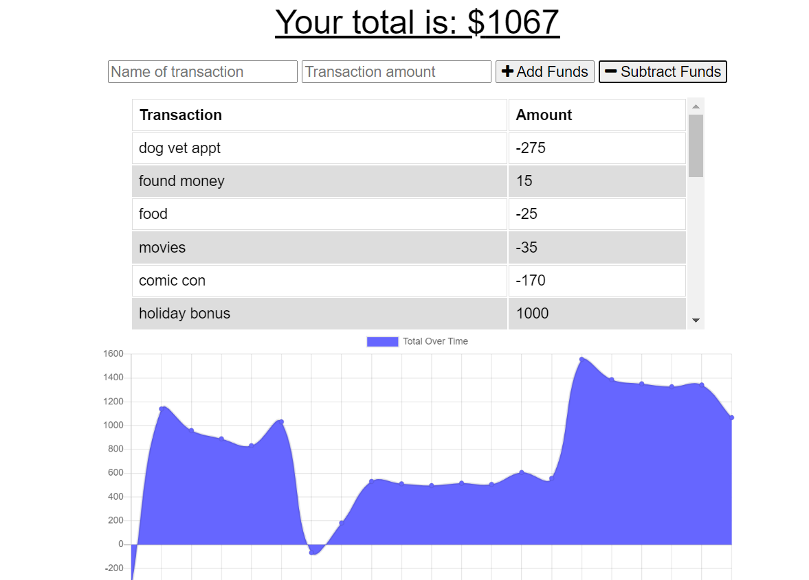

# balling-on-a-budget
Let's turn an existing budget tracking application into a Progressive Web Application (PWA) that provides users with seamless on/offline functionality.

## User Story
AS AN avid traveler
I WANT to be able to track my withdrawals and deposits with or without a data/internet connection
SO THAT my account balance is accurate when I am traveling 

## Installation
- Clone repo to machine
- Run ```npm install``` to gather all dependencies
- Start server with ```npm start```
- Application can be access on localhost:3001

## Screenshot



## Link

Access the application [here]()